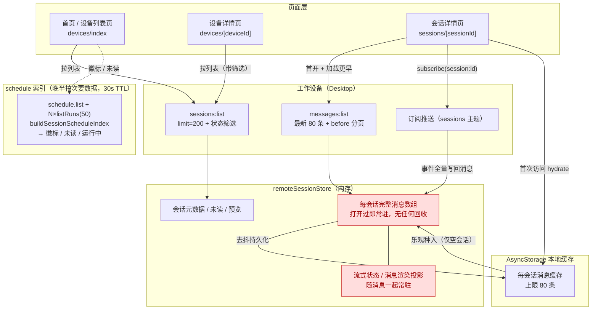
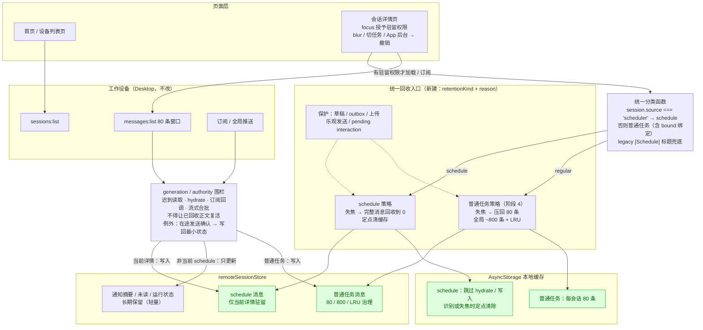

# 当前与新方案架构对比：Mobile 任务消息驻留

> 日期：2026-08-15
>
> 配套方案：[task-message-memory-governance-plan.md](./task-message-memory-governance-plan.md)（Mobile 任务消息内存治理方案）
>
> 图 1 基于当前代码基线（阶段 0 现状），图 2 为方案全部阶段（1–4）落地后的目标架构。
> 图 1 中红色节点是现状的问题点；图 2 中绿色节点是新增的治理能力。

## 图 1：当前基线

### 现状要点

- **无任务分类**：schedule 任务与普通任务走完全相同的驻留策略。
- **内存只进不出**：任何会话被打开过一次，完整消息数组和渲染投影就常驻 Store，没有压缩、预算或 LRU。
- **推送全量写回**：订阅推送带来的消息内容直接进入消息 Store，不区分用户是否在看。
- **唯一的量约束在磁盘**：AsyncStorage 每会话缓存上限 80 条，内存不受它约束。
- 列表数据（200 条 + 筛选）与 schedule 索引只影响展示，不参与任何回收决策——本方案保持这一点不变。

## 图 2：新方案（阶段 1–4 全部落地）

### 新方案要点

- **一个分类，两种策略**：统一分类函数读 `session.source`（不依赖 schedule 索引），决定 retentionKind；页面、Store、缓存层不各自判断。
- **统一回收入口**：新建（当前基线没有），页面只报告事实（失焦 / 切任务 / 后台），入口按分类和保护清单执行回收，不为 schedule 另起平行 Store。
- **写入围栏**：所有异步写入（读取、hydrate、推送、流式合批）过同一道 generation / authority 检查；唯一例外是失焦后在途的发送确认与交互回执，只允许写回最小状态。
- **工作设备不动**：数据源、协议、Desktop 行为全部保持不变；重新打开详情时从工作设备重读。
- **首页列表链路零改动**：`sessions:list`（200 条 + 筛选）与 schedule 索引的拉取方式、频率保持现状；分类复用列表返回里已有的 `session.source` 字段，零新增请求。该链路的目录额度与索引同步成本是已识别的后续优化方向，另行立项（方案 §17）。

## 关键差异对照

| 维度 | 当前基线 | 新方案 |
| --- | --- | --- |
| 任务分类 | 无 | source 主判据二分类，终身不变 |
| schedule 任务消息 | 打开过即常驻 | 仅当前详情驻留，失焦回收到 0 |
| 普通任务消息 | 常驻，无任何回收 | 压回 80 条 + 全局 ~800 条 LRU（阶段 4） |
| 本地缓存 | 所有任务都读写（每会话 80 条） | schedule 跳过并定点清除；普通任务不变 |
| 推送写入 | 全量写回消息 Store | 非当前 schedule 只更新摘要；写入过围栏 |
| 迟到异步结果 | 无防护，可随时写回 | generation 围栏拦截，在途发送确认例外 |
| 回收触发 | 无 | 统一入口：失焦 / 切任务 / App 后台，无定时器 |
| 数据安全 | 不适用（无回收） | 草稿 / outbox / 上传 / 乐观发送 / pending interaction 保护 |
| 工作设备与协议 | — | 完全不变（Mobile-only） |
